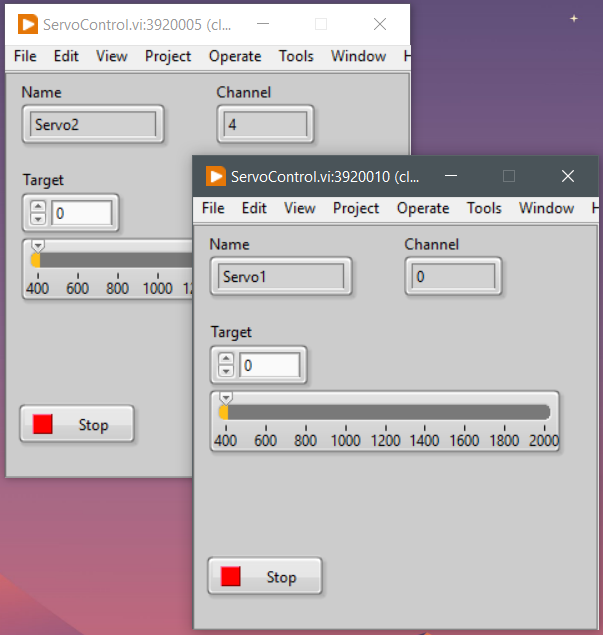

# Servos Controller

## About application

This Labview application allows you to control several servo drives using a Maestro controller.

## Features

- Adding / deleting servo from main window
- Multiple windows open at the same time to control different servos

